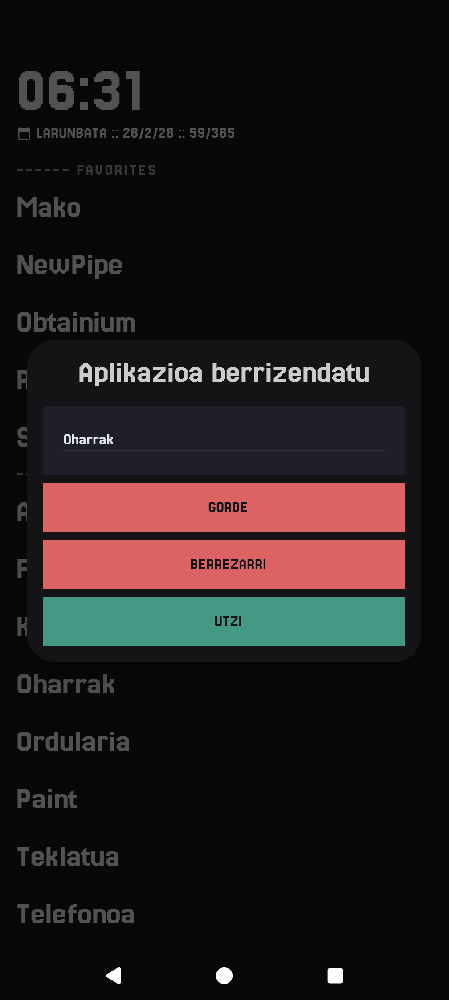

# Txori

**Txori** is a minimal, privacy-first focus session app designed to help you stay present and
intentional with your time.

Built entirely in **native Kotlin**, Txori runs fully **on-device**, avoids tracking, no internet
access, and no external APIs.

---

## Screenshots

| Focus                                                                    | Stopwatch                                                                    | About                                                                     |
|--------------------------------------------------------------------------|------------------------------------------------------------------------------|---------------------------------------------------------------------------|
|  |  |  |

---

## Features

- **Focus sessions**: Start simple sessions to dedicate time to a task without distractions.
- **Timer**: Set countdown timers for structured work or breaks.
- **Stopwatch**: Measure time freely for any activity.

---

## Installation

- Available on **[F-Droid](https://f-droid.org/app/com.rama.txori)** for easy installation and
  updates.
- Download the latest APK from the **[Releases page](https://github.com/rama-io/txori/releases)** or
  use **[Obtanium](https://github.com/ImranR98/Obtainium)** to get the newest version directly
  from the github releases.

---

## License

**Txori** is Free Software. You are free to use, study, share, and improve it under the terms of the
**GNU General Public License v3** or later.

---

## Tested Devices

| Device       | OS         | Year | Status     |
|--------------|------------|------|------------|
| Pixel 8 Pro  | Android 16 | 2026 | ✅ Verified |
| Pixel 6      | GrapheneOS | 2026 | ✅ Verified |
| Samsung On 5 | Android 6  | 2015 | ✅ Verified |

---

## Documents

- [Branding](./docs/branding.md)
- [Attributions](./docs/attributions.md)
